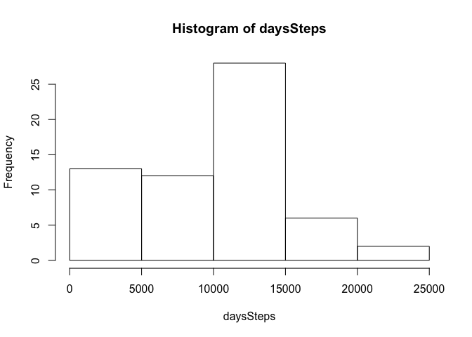
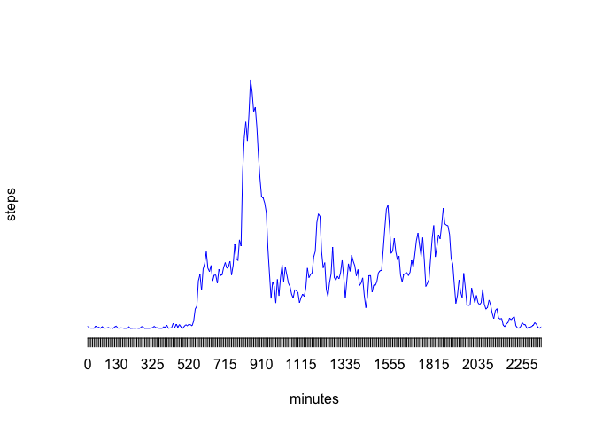
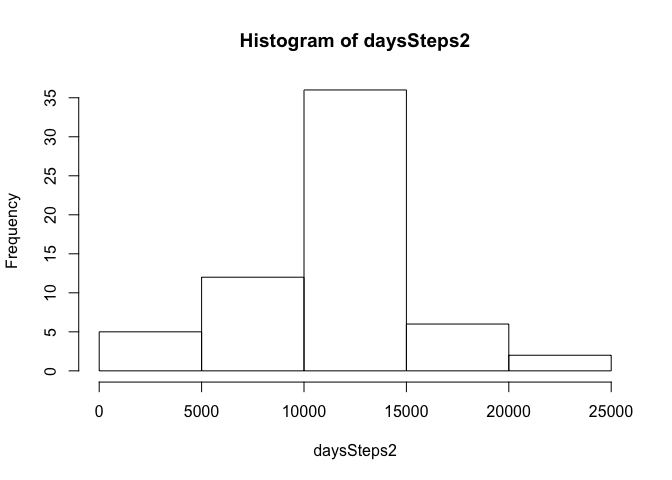

# Reproducible Research: Peer Assessment 1


## Loading and preprocessing the data


```r
library(dplyr)
```

```
## 
## Attaching package: 'dplyr'
## 
## The following object is masked from 'package:stats':
## 
##     filter
## 
## The following objects are masked from 'package:base':
## 
##     intersect, setdiff, setequal, union
```

```r
library(chron)
library(lattice)
activityData <- read.csv("data/activity.csv")
```

## What is mean total number of steps taken per day?

```r
daysSteps <- tapply(activityData$steps, activityData$date, sum, na.rm = TRUE)
hist(daysSteps)
```

 

```r
mean(daysSteps)
```

```
## [1] 9354.23
```

```r
median(daysSteps)
```

```
## [1] 10395
```

## What is the average daily activity pattern?

```r
intervalAverage <- tapply(activityData$steps, activityData$interval, mean, na.rm = TRUE)
plot(intervalAverage, type = "l", col = "Blue", axes=FALSE, ann=FALSE)
axis(1, at=1:length(intervalAverage), lab=c(names(intervalAverage)))
title(xlab = "minutes")
title(ylab = "steps")
```

 

```r
names(head(sort(intervalAverage, decreasing = TRUE), 1))
```

```
## [1] "835"
```

## Imputing missing values


```r
sum(is.na(activityData$steps))
```

```
## [1] 2304
```

```r
# Use average steps for an interval to replace NAs
activityData2 <- mutate(activityData, avgSteps = intervalAverage[match(activityData$interval, names(intervalAverage))])
activityData2 <- within(activityData2, steps <- ifelse(!is.na(steps), steps, avgSteps))
activityData2 <- activityData2[1:3]
daysSteps2 <- tapply(activityData2$steps, activityData2$date, sum)
hist(daysSteps2)
```

 

```r
mean(daysSteps2)
```

```
## [1] 10766.19
```

```r
median(daysSteps2)
```

```
## [1] 10766.19
```


## Are there differences in activity patterns between weekdays and weekends?

```r
activityData2 <- within(activityData2, dayType <- ifelse(is.weekend(date), "weekend", "weekday"))
activityData2 <- transform(activityData2, dayType = factor(dayType))
dataSummary <- summarize(group_by(activityData2, interval, dayType), steps = mean(steps))
xyplot(steps ~ interval|dayType, data=dataSummary, type="l", layout = c(1, 2))
```

 
